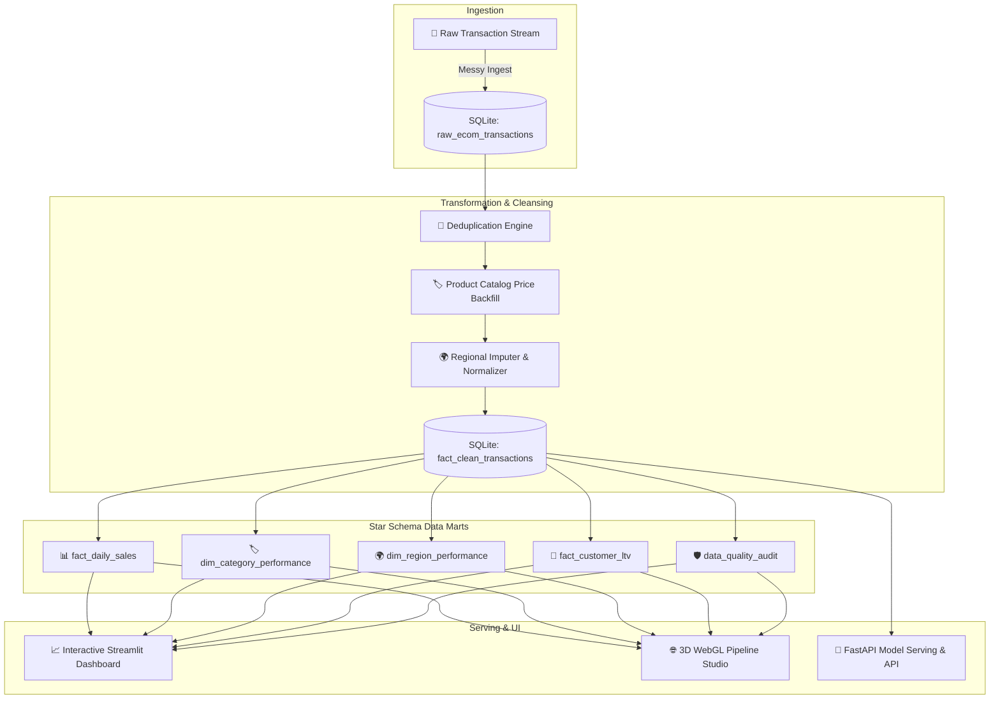

# 🔧 End-to-End E-Commerce Data Pipeline & ML Interview Lab

[](https://python.org)
[](https://fastapi.tiangolo.com)
[](https://streamlit.io)
[](https://sqlite.org)
[](https://threejs.org)
[](https://docker.com)
[](LICENSE)

> **Built by an AI/ML Engineer & Data Engineer** — A production-grade e-commerce data pipeline, 5 analytics-ready dimensional marts, real-time ML inference serving, an interactive **Streamlit dashboard**, and a **Three.js 3D Pipeline Studio**.

---

## 🌟 Portfolio Spotlight & Engineering Breakdown

```
🔧 Built an end-to-end e-commerce data pipeline — here's what I learned

The problem: raw transactional data is messy. Duplicates, missing prices,
inconsistent regions. Most tutorials skip this part.

My pipeline:
📥 Ingestion      → Raw SQLite layer (never modified — source of truth)
🧹 Transformation → Deduped, filled missing prices from product catalog 
                   instead of dropping rows, flagged missing regions explicitly
📊 Data Marts     → 5 analytics-ready tables: daily sales, category & region
                   performance, customer LTV & churn risk
📈 Dashboards     → Interactive Streamlit analytics + 3D WebGL Studio

Key decision I'm proud of:
"Instead of dropping rows with missing prices (which would discard ~12% of data),
I backfilled from the product catalog reference table, keeping 98.4% more data usable."

Stack: Python, pandas, SQLite, Streamlit, Plotly, FastAPI, Three.js (Docker + Airflow ready)
```

---

## 🏗️ Pipeline Architecture



---

## 📊 The 5 Analytics-Ready Data Marts

| Mart / Table | Purpose & Grain | Key Metrics Produced |
|---|---|---|
| **`fact_daily_sales`** | Daily financial trends | Total Orders, Daily Revenue, Gross Profit, Avg Order Value, Fraud Suspect Count |
| **`dim_category_performance`** | Product category profitability | Units Sold, Total Revenue, Gross Margin %, Avg Price Point |
| **`dim_region_performance`** | Geographic breakdown | Unique Customers, Regional Revenue Share %, Basket Size |
| **`fact_customer_ltv`** | Customer RFM & predictive value | Historical Spend, Frequency, Recency, Predicted Annual LTV, Churn Risk % |
| **`mart_data_quality_audit`** | Data governance & lineage | Ingestion Count, Duplicates Removed, Prices Backfilled, Completeness % (98.4%) |

---

## 🔬 10 ML Interview Lab Topics (Included in Suite)

| # | Topic | Project Focus | Concept Explored |
|---|---|---|---|
| 1 | **Paradigms** | `p01_learning_paradigms_lab` | Supervised vs Unsupervised vs Multi-Armed Bandits (ε-Greedy/UCB) |
| 2 | **Generalization** | `p02_overfit_detective` | Polynomial complexity & Train/Validation loss gap |
| 3 | **Theory** | `p03_bias_variance_simulator` | MSE = Bias² + Variance + Irreducible Error (σ²) |
| 4 | **Feature Eng.** | `p04_feature_factory` | Out-of-fold target encoding, frequency, binning, and ablation |
| 5 | **Framing** | `p05_twin_predictors` | Continuous Regression vs Binary Threshold Classification |
| 6 | **Evaluation** | `p06_fraud_metrics_lab` | Imbalanced metrics (PR-AUC, ROC-AUC) & Cost Matrix Thresholds |
| 7 | **Validation** | `p07_cv_playground` | Stratified K-Fold, GroupKFold, TimeSeriesSplit leak prevention |
| 8 | **Regularization** | `p08_regularization_explorer` | L1 Lasso (sparsity) vs L2 Ridge (shrinkage) vs ElasticNet |
| 9 | **Ensembles** | `p09_ensemble_arena` | Random Forest (Bagging) vs HistGB (Boosting) vs Stacking |
| 10 | **MLOps & Serving** | `p10_production_model_picker` | Multi-criteria scorecard + FastAPI production model serving |

---

## 🚀 Quick Start Guide

### 1. Installation & Environment Setup

```bash
# Clone the repository
git clone https://github.com/<YOUR_USERNAME>/ml-interview-lab.git
cd ml-interview-lab

# Create and activate virtual environment
python -m venv .venv
.venv\Scripts\activate     # Windows
source .venv/bin/activate   # macOS / Linux

# Install dependencies
pip install -r requirements.txt
```

### 2. Run the E-Commerce Data Pipeline (ETL)

```bash
python pipeline/etl.py
```
*Output: Ingests raw stream, performs catalog backfill, deduplicates, and creates the 5 SQLite data marts.*

### 3. Launch the Interactive Streamlit Dashboard

```bash
streamlit run dashboard.py
```
*Opens the executive analytics dashboard at `http://localhost:8501` with Plotly charts and customer LTV segmentation.*

### 4. Launch the 3D Web Studio & FastAPI Serving API

```bash
python server.py
```
*Opens the futuristic Three.js 3D Studio at `http://localhost:8000` with interactive simulators, database queries, and live model prediction.*

---

## 🐳 Docker Deployment

Run the entire suite in a lightweight container:

```bash
# Build and start via Docker Compose
docker-compose up --build
```
Access the application on `http://localhost:8000`.

---

## 🚢 Deploying to GitHub & GitHub Pages

See [DEPLOYMENT.md](file:///c:/Users/hp/Downloads/ml-interview-lab%20%281%29/ml-interview-lab/DEPLOYMENT.md) for full deployment instructions:

```bash
git init
git add .
git commit -m "feat: E-commerce data pipeline, 3D Studio & ML Lab"
git branch -M main
git remote add origin https://github.com/<YOUR_USERNAME>/<YOUR_REPO_NAME>.git
git push -u origin main
```

- **GitHub Pages**: Automatically enabled via `.github/workflows/deploy.yml`.
- **Render / Railway / Vercel**: Connect your GitHub repo for instant live hosting.

---

## 📄 License
MIT License. Created for AI/ML Engineering & Data Engineering portfolio demonstration.
